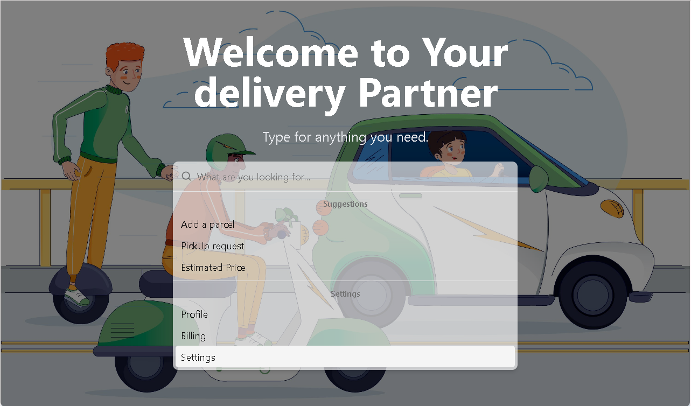

# 📦 Parcel Management System

A fully functional **Parcel Management System** built with the **MERN stack**. This platform allows users to book parcels for delivery, admins to assign delivery personnel, and delivery personnel to manage and complete deliveries.

## ✨ Features

- 📌 **User Authentication**: Secure login and registration with Firebase (includes Google login).
- 🔄 **Role-Based Access**: Three user roles – **User**, **Delivery Men**, and **Admin**.
- 📦 **Parcel Booking**: Users can book parcels with automatic price calculation.
- 📊 **Dashboard Statistics**: Admin dashboard with **bar chart & line chart** (React Apex Charts).
- 🌍 **Live Map Integration**: Delivery personnel can view parcel locations on a map (**React Leaflet**).
- 📅 **Date Filtering**: Admins can filter bookings by requested delivery date.
- 📋 **Delivery Management**: Admins can assign delivery personnel and track delivery status.
- ⭐ **Reviews & Ratings**: Users can review delivery personnel after successful deliveries.
- 🎨 **Responsive Design**: Fully optimized for **mobile, tablet, and desktop**.
- 🚀 **Tech Stack**: **MERN** (MongoDB, Express, React, Node.js) with **ShadCN UI, React Hook Form, SweetAlert, React Icons, and Lottie** animations.

## 🔑 Admin Credentials

- **Admin Email**: `mahmudaaktermumu7@gmail.com`
- **Admin Password**: `Mumu@9_-=`

## 🔑 Deliveryman Credentials

- **Admin Email**: `meherafrinmridula@gmail.com@gmail.com`
- **Admin Password**: `Mumu@9_-=`

## 🌍 Live Demo

🔗 **Live Site URL**: [https://ugly-limit.surge.sh/](https://ugly-limit.surge.sh/)

## 📌 Technologies Used

- **🔥 ShadCN UI** for beautiful and modern UI components.
- **⚡ React Hook Form** for smooth form handling and validation.
- **🎉 SweetAlert** for elegant pop-up notifications instead of default alerts.
- **🎨 Lottie Animations** to enhance user experience.
- **🔐 JWT Authentication** with local storage for persistent login.
- **📊 TanStack Query** for optimized GET data fetching.
- **⚡ React CountUp** for animated number counters in statistics.
- **📍 React Leaflet** for interactive parcel location display.

## 🚀 How It Works

### User Dashboard:
- 📦 **Book a Parcel**: Fill in details to book a delivery.
- 📜 **View My Parcels**: Track all booked parcels with status updates.
- 📝 **Leave a Review**: Rate delivery personnel after delivery completion.
- 🔄 **Update / Cancel Booking**: Modify or cancel pending bookings.

### Delivery Men Dashboard:
- 📋 **My Delivery List**: View assigned deliveries and update statuses.
- 📍 **View Location**: Check delivery locations on an interactive map.
- ⭐ **My Reviews**: View user reviews and ratings.

### Admin Dashboard:
- 📦 **Manage All Parcels**: Assign delivery personnel and track statuses.
- 📊 **Statistics Dashboard**: View bookings and deliveries via charts.
- 🛠 **Manage Users & Delivery Men**: Promote users to delivery men or admin.

## 🏆 Bonus Features
- 📅 **Date Filtering**: Admins can filter bookings within a date range.
- 🌟 **Top Delivery Men**: Display high-performing delivery personnel.
- 💰 **Payment System**: Users can mark parcels as paid.

---
## 📦 Dependencies

### **Frontend**:
- `React` - A JavaScript library for building user interfaces.
- `React Router DOM` - A library for routing in React applications.
- `Axios` - Promise-based HTTP client for making API requests.
- `React Leaflet` - Map integration for parcel tracking.
- `React ApexCharts` - For data visualization (charts).
- `Redux` - State management tool for React apps.
- `Material-UI` - A React UI framework for responsive design.
- `React Hook Form` - Library for managing form validation and data.

### **Backend**:
- `Node.js` - JavaScript runtime used for the backend.
- `Express.js` - Web application framework for Node.js.
- `MongoDB` - NoSQL database for storing user and parcel data.
- `Mongoose` - MongoDB object modeling tool for Node.js.
- `JWT` - JSON Web Token for secure authentication.
- `bcryptjs` - Library for password hashing and security.
- `dotenv` - Loads environment variables for configuration.
- `cors` - Middleware to enable cross-origin requests.

### **Development**:
- `Nodemon` - Tool that helps during development by automatically restarting the server when changes are made.

---

⚡ **Developed with love ❤️ using the MERN Stack!**
